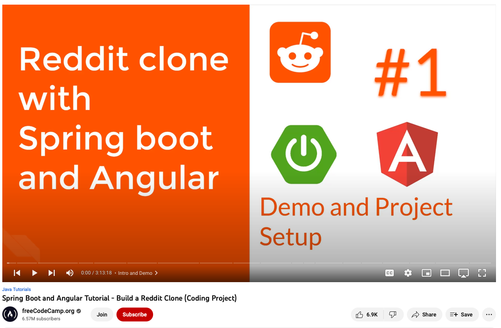

# Angular Reddit Clone Frontend [](https://github.com/spencerlepine/angular-reddit-workshop/actions/workflows/build.yml)

Reddit clone frontend built using Angular - You can find the backend source code here - [https://github.com/spencerlepine/spring-reddit-workshop](https://github.com/spencerlepine/spring-reddit-workshop)




### ⚙️ Local Development Setup

> _Prerequisites_: Angular CLI version 8.3.4+

```shell
git clone https://github.com/spencerlepine/angular-reddit-workshop
cd angular-reddit-workshop
npm install
npm start
# Open localhost:4200 in browser
```


### 📜 Links
- YouTube tutorial: [https://www.youtube.com/watch?v=DKlTBBuc32c](https://www.youtube.com/watch?v=DKlTBBuc32c)
- Tutorial Repository Backend: [https://github.com/SaiUpadhyayula/spring-reddit-clone](https://github.com/SaiUpadhyayula/spring-reddit-clone)
- Tutorial Repository Frontend: [https://github.com/SaiUpadhyayula/angular-reddit-clone](https://github.com/SaiUpadhyayula/angular-reddit-clone)

# Screenshots
1. Home Page


2. View Post Page


3. Create Post Page


4. Create Subreddit Page


5. User Profile Page

